# Algothon 2026 Quantitative EDA

Generated from `prices.txt` with 500 daily observations and 51 assets.

## Headline findings

- Average pairwise daily-return correlation: **0.200**.
- First principal component explains **22.7%** of standardized-return variance.
- Median annualized volatility: **33.5%**.
- Median full-sample Sharpe: **-0.41**.
- Strongest full-sample drift: **OTCS, CUBO, RRES, MMBT, ILVX**.
- Weakest full-sample drift: **FARS, NPCK, EAFC, MHRM, SRNA**.
- 20-day reversal mean next-day cross-sectional IC: **0.022** (t-stat **2.74**).

These are exploratory in-sample statistics, not guarantees of hidden-window performance. Strategy selection should use walk-forward tests.

## Core charts

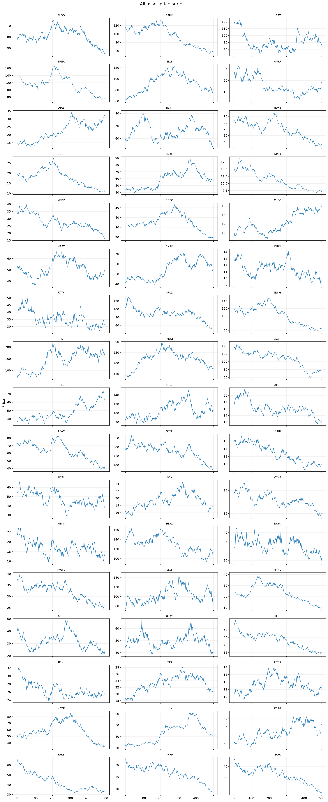
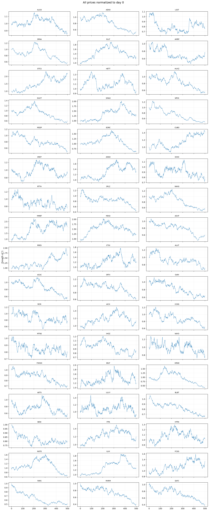
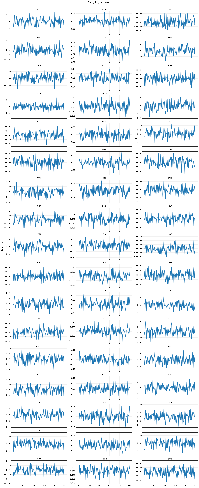
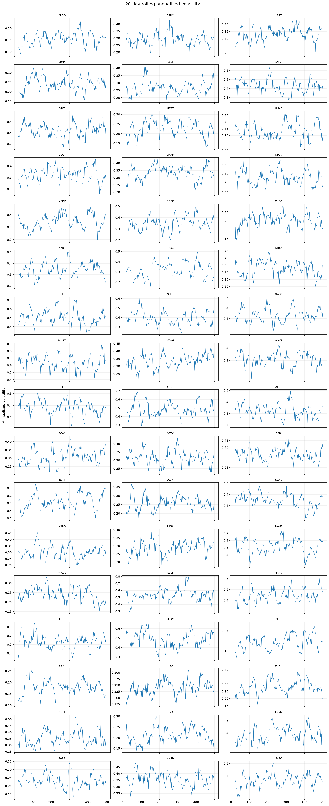
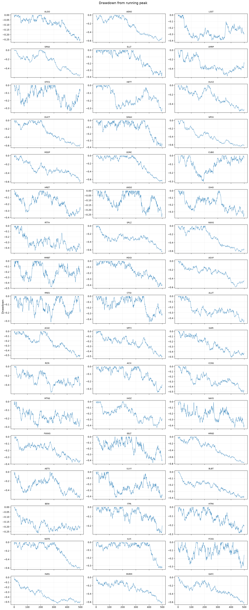
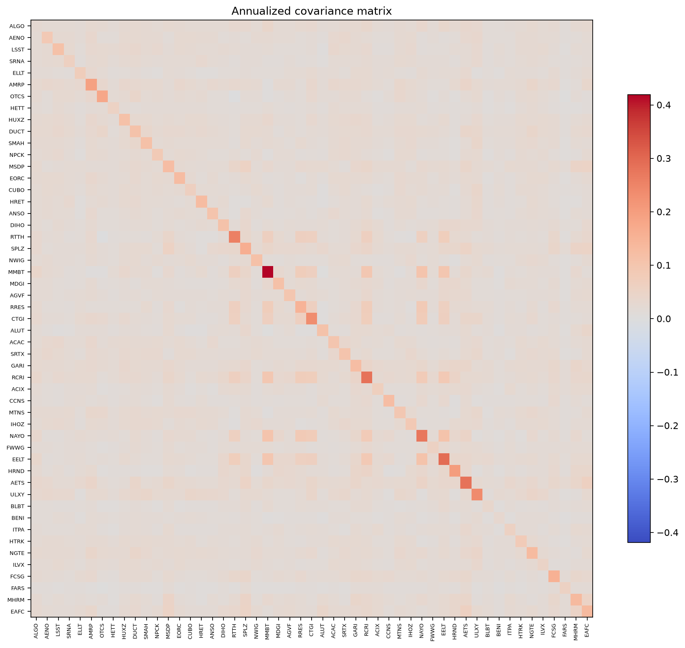
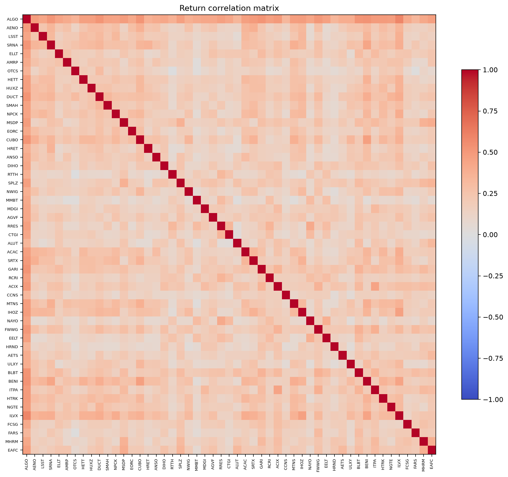
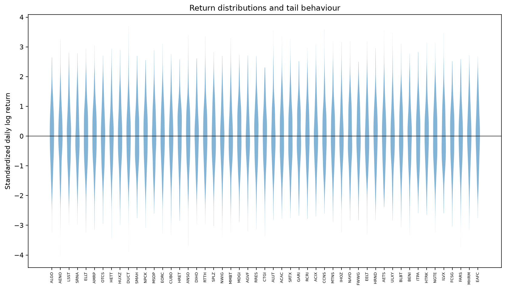
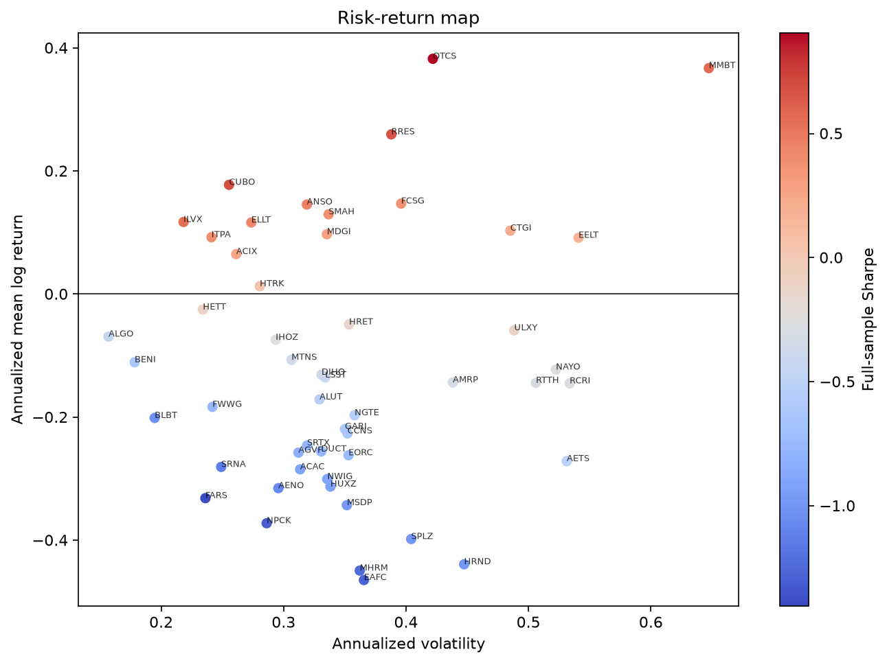
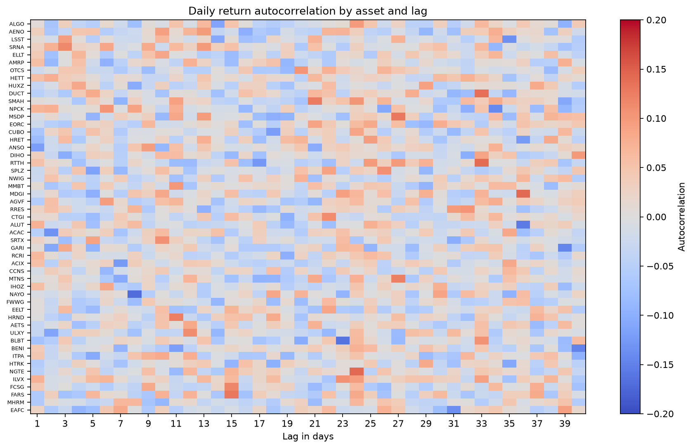
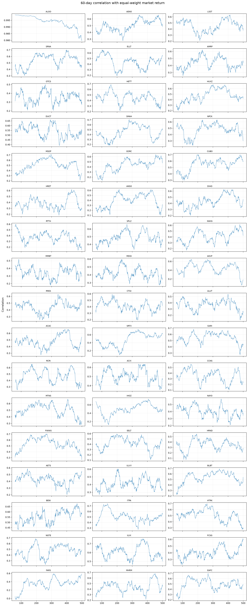
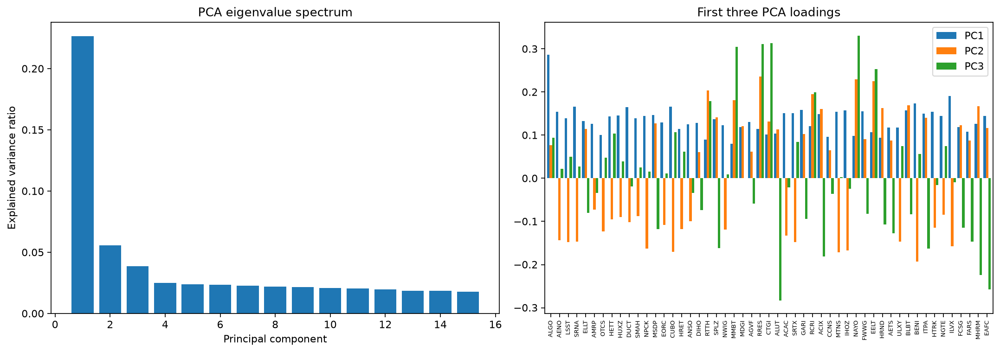
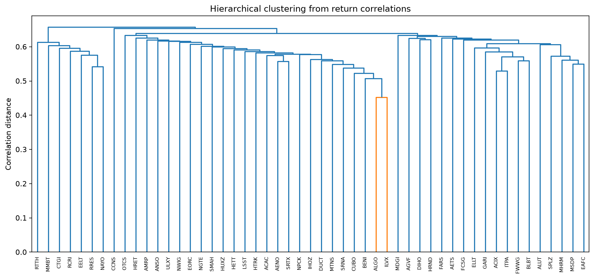
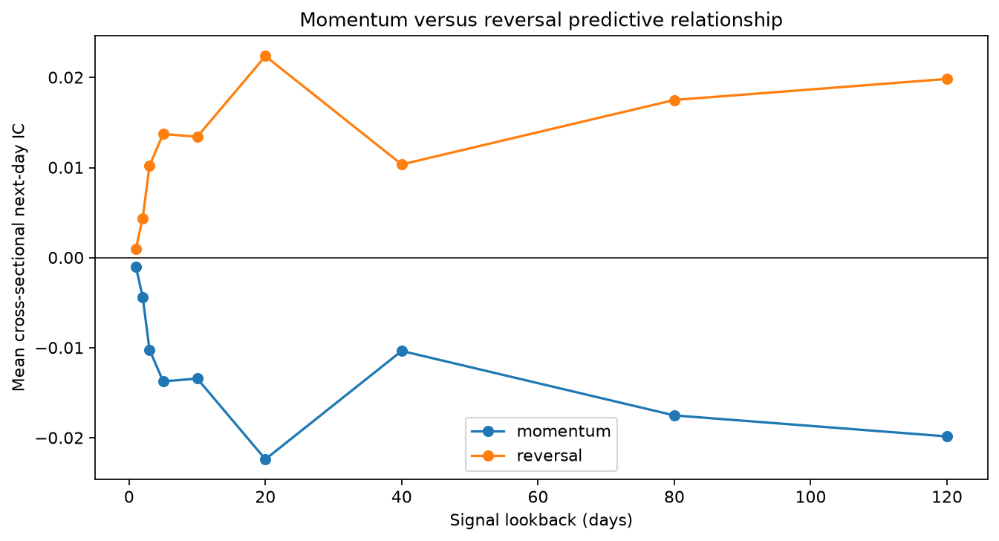
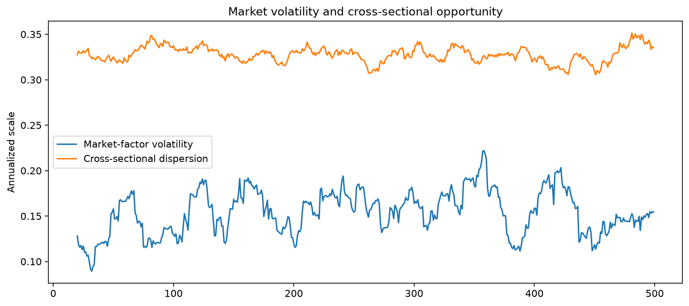

## Per-asset technical dashboards

The `figures/technical/` directory contains a dashboard for every asset with moving averages, Bollinger Bands, RSI(14), MACD, and rolling annualized volatility.

## Current strategy diagnostics

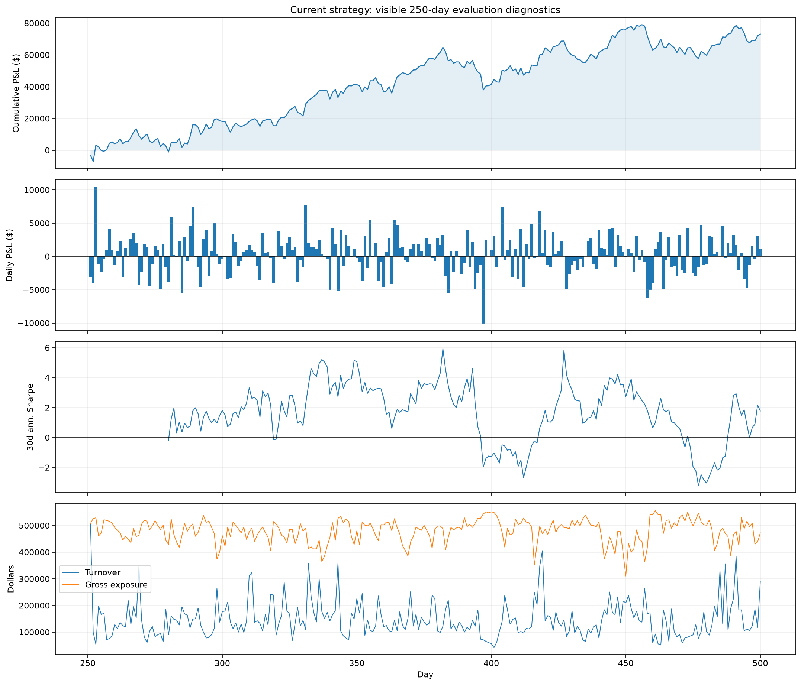
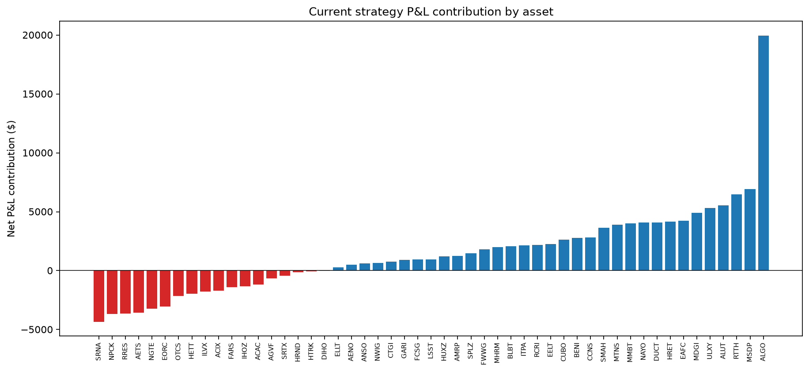
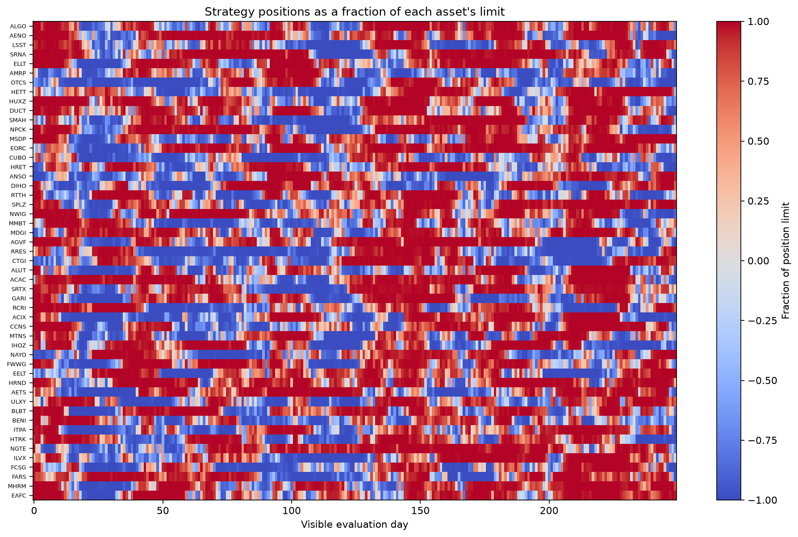

Walk-forward results are stored in `tables/walk_forward.csv`. The final visible-window score must be treated as an in-sample diagnostic rather than a hidden-window performance estimate.

## Machine-readable results

The `tables/` directory contains the summary statistics, covariance/correlation matrices, rolling volatility, autocorrelations, PCA results, and forward information coefficients.
